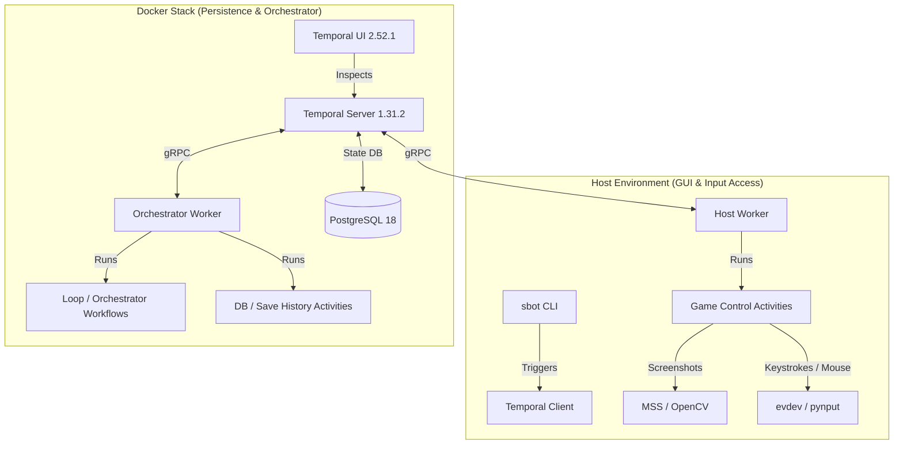

# Gemini Agent: Project Configuration & Protocols

## 📐 Architecture Map

This project implements an autonomous AFK gameplay bot and orchestrator for the game **Satisfactory**, structured around **Temporal** workflows and activities.



### 📂 Directory Structure
*   `tools/cli.py` ([cli.py](file:///home/adilson/Projects/github/satisfactory-ai/tools/cli.py)): The main entry point `sbot` for command-line control (planning, triggers, calibration, status).
*   `workflows/`: Temporal Workflows coordinating loops, schedules, and higher-level automation state.
*   `activities/`: Temporal Activities containing concrete execution units (mouse moves, save file backups).
*   `workers/`: Workers dividing task queues:
    *   **Orchestrator Worker** (Runs in Docker): Responsible for workflows and persistence tasks.
    *   **Host Worker** (Runs on Host): Has access to UI sessions, screens, and input devices.
*   `utils/`: Helpers for recipe lists, parsing save files (`save_parser.py`), and analyzing game logs.

---

## 🛠️ Setup Steps

### 1. Requirements
*   Python `>= 3.14`
*   `uv` for Python virtual environment and dependency management
*   Docker & Docker Compose

### 2. Environment Setup
Create a virtual environment and sync dependencies:
```bash
uv sync
```

### 3. Running the Stack
Launch the database, migration pipeline, Temporal server, and local orchestrator worker:
```bash
docker compose up -d
```

### 4. Running the Host Worker
Run the GUI/interaction worker on your local machine (needs display access):
```bash
uv run python workers/worker.py
```

---

## 📦 Core Dependencies
*   `temporalio`: Workflow orchestration.
*   `mss`: High-performance desktop screenshots.
*   `opencv-python` & `numpy`: Computer vision template matching.
*   `pytesseract`: OCR for reading game text.
*   `evdev` & `pynput`: Direct input injection (evdev for game-level keyboard/mouse, pynput fallback).

---

## 🤝 Project Conventions & Protocols

1.  **Non-Root Execution**:
    *   The Docker container runs as host user `1000:1000` to prevent file permission mismatches on mounted directories (`./stats`).
    *   CPython toolchains and dependencies are compiled under `/opt/uv` and made globally executable (`chmod 755`).
2.  **Test-Driven Development**:
    *   All CLI expansions and helpers must have associated unit tests in `tests/`.
    *   Verify code locally before pushing:
        ```bash
        uv run pytest
        uv run ruff check
        uv run mypy .
        ```
3.  **Idempotent Schema Upgrades**:
    *   Temporal migrations are managed via a decoupled `temporal-schema-setup` job using `temporalio/admin-tools`.
    *   All database creations must be safe to re-run (e.g. `|| true` on schema initialization steps).
4.  **Factory Planning & Fluid Protocols (CRITICAL)**:
    *   **Sinkable Outputs (Solids)**: Machines producing primary solid items (e.g. `Dark Matter Crystal`, `Superposition Oscillator`, `Rubber`) can and should be run at **100% building capacity (250% overclock)**. The excess production can be routed to the AWESOME Sink. The Dashboard UI will display `100.0%` utilization, and no capacity warnings should be emitted.
    *   **Un-sinkable Outputs (Liquids)**: Machines producing **only a liquid** as their primary output (e.g. `Dark Matter Residue` via Converter, `Alumina Solution`, `Water`) **cannot** be sinked. Running these at max capacity risks pipeline overflow and factory gridlock. These machines **MUST be strictly throttled** to their exact calculated target rate. A fractional `machine_count` results in an explicit clock-speed warning (e.g. `83.9% ⚠`), which the user must apply in-game.
    *   *Implementation Rule*: Checking if an output is "un-sinkable" is determined solely by whether the step's `item` (the primary output) is in the hardcoded `fluid_items` set (in `tools/late_game_planner.py`). Byproducts (like `Dark Matter Residue` produced by `Superposition Oscillator`) do NOT trigger warnings on the primary solid machine, because the solid machine can still run at 100% capacity and excess solids can be sinked, while the excess byproduct fluids are inherently balanced by downstream demand (if downstream is also running at 100% capacity).
